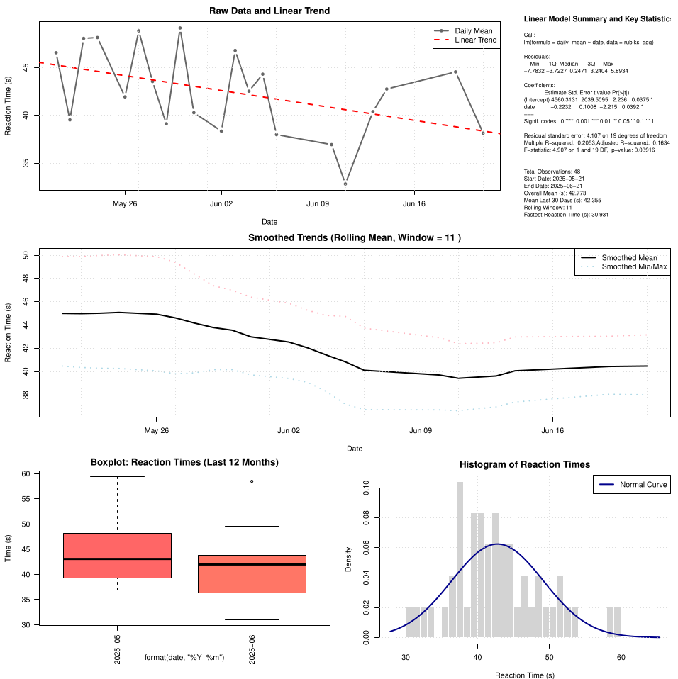

# CubeRT

A small terminal-based project I built to measure and analyze Rubik’s Cube reaction times using nothing more than a keyboard, Bash, and R.

The original idea was simple:

When speedcubing, reaction time matters more than many people think.  
Recognizing the cube state, committing to the first move, and avoiding hesitation can easily cost valuable milliseconds.

Instead of buying dedicated hardware timers or using web-based reaction tools, I wanted a lightweight local solution that runs directly on Linux.

This project allows you to:

- start a timer by pressing `SPACE`
- stop the timer by pressing `SPACE` again
- automatically log every reaction attempt
- store all results in a CSV file
- generate statistical analysis in R
- automatically open a PDF performance report

Everything runs locally.

No GUI  
No cloud tools  
No unnecessary dependencies

Just your keyboard and your reaction speed.

---

## How it works

### Bash script (`rubiks.sh`)
The Bash script handles the interactive timing process:

- waits for first spacebar input
- starts nanosecond timer
- waits for second spacebar input
- stops timer
- calculates reaction time
- stores result in `reactiontime.csv`
- launches R analysis
- opens the generated PDF report

---

### R script (`rubiks.R`)
The R script analyzes your performance history and generates:

- daily reaction time averages
- minimum and maximum trends
- rolling averages
- linear regression trend analysis
- histogram of reaction times
- monthly boxplots
- summary statistics

The output is exported as:

```bash
rubiks.pdf
```

---

## Example workflow

```bash
chmod +x rubiks.sh
./rubiks.sh
```

Then:

1. Press `SPACE` to start
2. React as fast as possible
3. Press `SPACE` again to stop
4. Review your updated analysis report

---

## Example output



---

## Project structure

```bash
.
├── rubiks.sh
├── rubiks.R
├── README.md
├── example_output.png
├── .gitignore
└── LICENSE
```

Generated during runtime:

```bash
reactiontime.csv
rubiks.pdf
```

---

## Why I built this

I enjoy small projects that combine everyday hobbies with data analysis.

Speedcubing already has a lot of timing tools for solve times, but I was more interested in measuring reaction latency itself and tracking whether repeated training actually improves first-move response speed over time.

This project was mostly built for fun, but it also became a nice mix of:

- Bash scripting
- statistical analysis
- automation
- personal performance tracking
- speedcubing experimentation

---

## Future improvements

Possible additions:

- official WCA-style inspection timer
- scramble generator
- better visualizations
- percentile analysis
- solve-time integration
- keyboard latency benchmarking

---

## Requirements

### Bash
- bc
- xdg-open

### R
- Base R is sufficient

---

## License

MIT License
